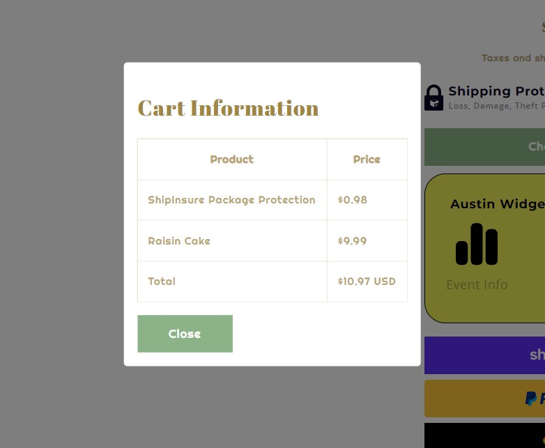

# ShopifyWidget

## Description
This app is a chrome extension that embeds UI widgets into Shopify platforms to:
- Capture product detail pages and do web scraping to store imge urls of the products
- Embed custom UI widget in the checkout page to display the product list and their total price.

# Tech Stacks Used
- JavaScript
- CSS
- Native Chrome API

# Challenges
- Had difficulty with aligning CSS configuration with Shopify native environment.
- Embedding custom UI widgets into Shopify webpages required synchronization with existing DOM elements.

# Features
- The extension scrapes the product detail page and store images to databsae through a RESTful API call to the Node.js backend
- View History icon displays a custom modal to show the latest event logs.
 

- The extension displays the information about the cart with product information and total price.
 

