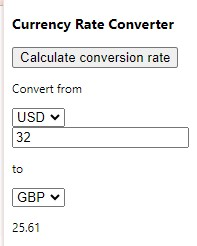

# ShopifyWidget

## Description
This app is a chrome extension that embeds UI widgets into Shopify platforms to:
- Capture product detail pages and do web scraping to store imge urls of the products
- Embed custom UI widget in the checkout page to display the product list and their total price.
- Calculate currency conversion in different currencies - USD, AUD, CAD

# Tech Stacks Used
- JavaScript
- CSS
- Native Chrome API

# Challenges
- Had difficulty with aligning CSS configuration with Shopify native environment.
- Embedding custom UI widgets into Shopify webpages required synchronization with existing DOM elements.

# Requirements
- Chrome Browser version > 85

# Setup
- Download the extension files from the GitHub repository:
```
git clone git@github.com:austinL394/chrome-extension-test.git
```
- Open the Chrome browser and navigate to `chrome://extensions/`.
- Enable "Developer mode" by toggling the switch in the top-right corner of the page.
- Click the "Load unpacked" button and select the directory where you downloaded the extension files.


# Features
- The extension scrapes the product detail page and store images to databsae through a RESTful API call to the Node.js backend
- View History icon displays a custom modal to show the latest event logs.
<br>


- The extension displays the information about the cart with product information and total price.
<br>


<br>

- The extension calculates conversion rate between different types of currencies.
<br>

